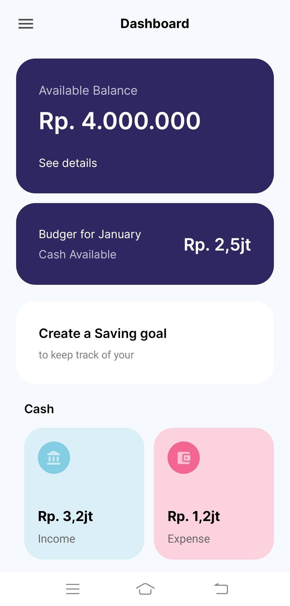

# Personal Finance Application (PFA)

Hi Future Developer!

Welcome to my latest creation - the Personal Finance Application (PFA)! I'm thrilled to introduce you to this state-of-the-art mobile app built using React Native and Expo. PFA is not just an app; it's your personal financial companion designed to revolutionize the way you manage your money.

Harnessing the power of React Native and Expo, PFA makes recording and tracking your finances a breeze. From effortlessly logging your income and expenses to providing insightful budgeting tools, this application is crafted with the latest technology to empower you on your financial journey.

Explore the sleek interface, enjoy the intuitive user experience, and take control of your financial well-being with the Personal Finance Application. It's not just an app; it's your financial sidekick, always ready to assist you in achieving your financial goals.

*Thank you for your interest. Happy coding!*

## ✨ Features:

- 📱 Full responsiveness
- ⏳ Page loading state
- 🔄 How to reuse layouts
- 📁 Folder structur
- 💸 Record Income and Expenses
- 📊 Budget Preparation
- 🔄 Customizable Categories

## Powering Up with an Electrifying Tech Stack! ⚡

This project is fueled by an electrifying lineup of cutting-edge technologies:

- [React Native](https://reactnative.dev/) - Elevate your mobile app development experience.
- [Expo](https://expo.dev/) - Streamline the process of building robust and scalable mobile applications.

Prepare for an exhilarating ride through innovation and efficiency with this impressive tech stack!

## Licensing Groove🕺

Exciting news! This project is grooving to the rhythm of the [MIT License](https://github.com/novaardiansyah/genius-ai-generator/blob/main/LICENSE)! 🎉

## Let's Connect! 📞

Need to chat? Feel free to drop me a line via [Email](mailto:novaardiansyah78@gmail.com) or hit me up on [WhatsApp](https://wa.me/6289506668480?text=Hi%20Nova,%20I%20have%20a%20question%20about%20your%20project%20on%20GitHub:%20https://github.com/novaardiansyah/genius-ai-generator). I'm just a message away, ready to groove with you! 📩

## Sneak Peek (Dev) 🌟

Get a glimpse of the app's enchanting world by exploring the current progress at [live demo not available](). Feast your eyes on these snapshots that showcase the app's dynamic essence:

  

## Project Status 🚀 

